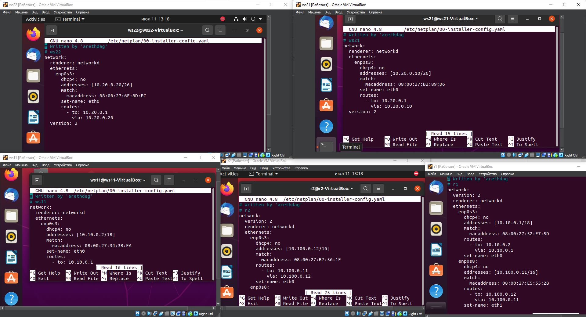
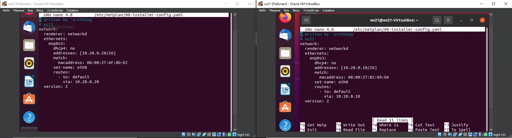
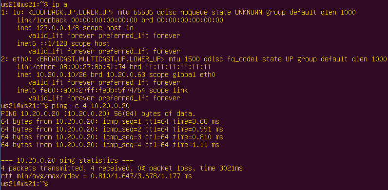

# Сети в Linux.
    Настройка сетей в Linux на вируальных машинах.
## Part 1. Инструмент ipcalc.

**==Выполнение задания==**
    Поднимаем виртуальную машину ws1.
    - Выполнив команду `cat /etc/issue.`, проверим версию установленной Ubuntu.  

#### 1.1. Сети и маски
- Определяем и записываем 
1) Адрес сети `192.167.38.54/13`

2) Переводим маску `255.255.255.0` в префиксную и двоичную запись

    Переводим маску `255.255.255.0/15` в обычную и двоичную
    

    Переводим маску `11111111.11111111.11111111.11110000` в обычную и префиксную
    

3) Минимальный и максимальный хост в сети `12.167.38.4`

    при маске: `/8`
    

    при маске: `11111111.11111111.00000000.00000000`
    

    при маске: `255.255.254.0`
    

    при маске: `/4`
    

#### 1.2. Localhost
    Можно обратиться только к адресам в диапазоне `127.0.0.1 - 127.255.255.254`
- 194.34.23.100 - нельзя обратиться (вне диапазона)
- 127.0.0.2 - можно обратиться (в диапазоне)
- 127.1.0.1 - можно обратиться (в диапазоне)
- 128.0.0.1 - нельзя обратиться (вне диапазона)

#### 1.3. Диапазоны и сегменты сетей
    1) Какие из перечисленных IP можно использовать в качестве публичного, а какие только в качестве частных: 
    10.0.0.45, 
    134.43.0.2, 
    192.168.4.2, 
    172.20.250.4, 
    172.0.2.1, 
    192.172.0.1, 
    172.68.0.2, 
    172.16.255.255, 
    10.10.10.10, 
    192.169.168.1
    
    **==Частные IP адреса:==**
    
Класс А:
`10.0.0.0 - 10.255.255.255`

Класс B:
`172.16.0.0 - 172.31.255.255`

Класс C:
`192.168.0.0 - 192.168.255.255`

- 10.0.0.45 - частный
- 192.168.4.2 - частный
- 172.20.250.4 - частный
- 172.16.255.255 - частный
- 10.10.10.10 - частный

- 134.43.0.2 - публичный
- 172.0.2.1 - публичный
- 192.172.0.1 - публичный
- 172.68.0.2 - публичный
- 192.169.168.1 - публичный

2) Какие из перечисленных IP адресов шлюза возможны у сети 10.10.0.0/18: 
10.0.0.1, 
10.10.0.2, 
10.10.10.10, 
10.10.100.1, 
10.10.1.255

**==Диапазон доступных сетей:==**
`10.10.0.1 - 10.10.63.254`

- 10.10.0.2 - доступен
- 10.10.10.10 - доступен
- 10.10.1.255 - доступен

- 10.0.0.1 - не доступен
- 10.10.100.1 - не доступен

## Part 2. Статическая маршрутизация между двумя машинами

**==Выполнение задания==**
#### Подними две виртуальные машины (далее -- ws1 и ws2).

#### С помощью команды `ip a` посмотри существующие сетевые интерфейсы.

#### 2.1. Добавление статического маршрута вручную
Описан сетевой интерфейс, соответствующий внутренней сети, на обеих машинах и заданы следующие адреса и маски: 
`ws1 - 192.168.100.10, маска /16`, `ws2 - 172.24.116.8, маска /12`. 
Выполнил команду `netplan apply` для перезапуска сервиса сети.

Поле ethernets содержит настройки проводных интерфейсов, в качестве значений выступают поля с именами интерфейсов, которые содержат поля с настройками. Для включения DHCP по протоколу IPv4 используется опция dhcp4, в которой можно указать как true/false, так и yes/no.
Настройка статического IP-адреса.

В поле dchp4 прописываем значение false, так как мы не используем DHCP. Поле addresses подразумевает список значений, которые заключаются в квадратные скобки и перечисляются через запятую, скобки обязательны, даже если значение одно. (Также можно использовать и альтернативный вариант синтаксиса) Формат записи IP-адреса: адрес/префикс, префикс /24 соответствует маске 255.255.255.0.

Для указания шлюза служит поле gateway4, а для настройки DNS - nameservers, которое содержит вложенные поля, мы должны указать как минимум одно, с адресами DNS-серверов.

Если требуется указать несколько IP-адресов для одного интерфейса, то запись будет выглядеть так: addresses: [192.168.233.154/24, 192.168.1.154/24]  или addresses: - 192.168.233.154/24 - 192.168.1.154/24

#### 2.2. Добавление статического маршрута с сохранением

Добавил статический маршрут от одной машины до другой и обратно при помощи команды вида `ip r add` и пропинговал.

## Part 3.
**==Выполнение задания==**

#### 3.1. Скорость соединения

- 8 Mbps = 1 MB/s 
- 100 MB/s = 819200 Kbps 
- 1 Gbps = 1024 Mbps 

#### 3.2. Утилита iperf3
Измерил скорость соединения между ws1 и ws2.

## Part 4. Сетевой экран

**==Выполнение задания==**
#### 4.1. Утилита iptables.

Создал файл /etc/firewall.sh, имитирующий фаерволл, на ws1 и ws2:

Нужно добавить в файл подряд следующие правила:

1) На ws1 примени стратегию, когда в начале пишется запрещающее правило, а в конце пишется разрешающее правило (это касается пунктов 4 и 5).
2) На ws2 примени стратегию, когда в начале пишется разрешающее правило, а в конце пишется запрещающее правило (это касается пунктов 4 и 5).
3) Открой на машинах доступ для порта 22 (ssh) и порта 80 (http).
4) Запрети echo reply (машина не должна «пинговаться», т.е. должна быть блокировка на OUTPUT).
5) Разреши echo reply (машина должна «пинговаться»).

Командой ping найди машину, которая не «пингуется», после чего утилитой nmap покажи, что хост машины запущен.

## Part 5 Статическая маршрутизация сети

      - 5.1 Настройка адресов машин
      - 5.2 Включение переадресации IP-адресов
      - 5.3 Установка маршрута по-умолчанию
      - 5.4 Добавление статических маршрутов
      - 5.5 Построение списка маршрутизаторов
      - 5.6 Использование протокола ICMP при маршрутизации

### 5.1 Настройка адресов машин

Настроим конфигурации машин в etc/netplan/00-installer-config.yaml согласно сети на рисунке.

> Требуемая конфигурация
*************************************************************************************************************************
Отредактируем содержание файлов etc/netplan/00-installer-config.yaml для каждой машины.

> Содержание файлов etc/netplan/00-installer-config.yaml и результаты выполнения команды sudo netplan apply для всех устройств
*************************************************************************************************************************
Командой ip -4 a проверим, что адреса машин заданы верно. 

Также пропингуем ws22 с ws21. Аналогично пропингуем r1 с ws11.

### 5.2 Включение переадресации IP-адресов

Для включения переадресации IP, выполним команду на роутерах: sysctl -w net.ipv4.ip_forward=1
При таком подходе переадресация не будет работать после перезагрузки системы.

> Результаты команд sysctl -w net.ipv4.ip_forward=1 на роутерах и фрагмент файла /etc/sysctl.conf с подтверждением того, что команда не приминилась.
*************************************************************************************************************************
Откроем файлы /etc/sysctl.conf и раскомментируем строки:
net.ipv4.ip_forward = 1
При использовании этого подхода, IP-переадресация включится на постоянной основе.

### 5.3 Установка маршрута по-умолчанию

Настроим маршруты по-умолчанию (шлюз) для рабочих станций. Для этого добавим default перед IP роутера в файлах конфигураций.

> Скрины с содержанием файлов etc/netplan/00-installer-config.yaml, вызовом ip r и посмотрим, что добавился маршрут в таблицу маршрутизации

*************************************************************************************************************************
Пропингуем с ws11 роутер r2 и посмотрим на r2, что пинг доходит. Для этого используем команду:
tcpdump -tn -i eth1 на r2

### 5.4 Добавление статических маршрутов

Добавим в роутеры r1 и r2 статические маршруты в файле конфигураций etc/netplan/00-installer-config.yaml. Вызовем ip r и посмотрим таблицы с маршрутами на обоих роутерах. 

> Скрины статических маршрутов в файлах конфигураций r1 и r1 и вызов ip r
*************************************************************************************************************************
Запустим команды на ws11:
ip r list 10.10.0.0/[маска сети] и ip r list 0.0.0.0/0

> Команды ip r list 10.10.0.0/[маска сети] и ip r list 0.0.0.0/0 выполненные на ws11
При наличии двух и более маршрутов выбирается маршрут с самой длинной маской т.к. он более точный

### 5.5 Построение списка маршрутизаторов

Запустим на r1 команду дампа: tcpdump -tnv -i eth0
При помощи утилиты traceroute построим список маршрутизаторов на пути от ws11 до ws21

> Выполнение команды traceroute до хостов 10.10.0.1, 10.100.0.12, 10.20.0.10 с ws11 с замером дампа с r1 

Каждый пакет проходит на своем пути определенное количество узлов, пока достигнет своей цели. Причем, каждый пакет имеет свое время жизни. Это количество узлов, которые может пройти пакет перед тем, как он будет уничтожен. Этот параметр записывается в заголовке TTL, каждый маршрутизатор, через который будет проходить пакет уменьшает его на единицу. При TTL=0 пакет уничтожается, а отправителю отсылается сообщение Time Exceeded. Команда traceroute linux использует UDP пакеты. Она отправляет пакет с TTL=1 и смотрит адрес ответившего узла, дальше TTL=2, TTL=3 и так пока не достигнет цели. Каждый раз отправляется по три пакета и для каждого из них измеряется время прохождения. Пакет отправляется на случайный порт, который, скорее всего, не занят. Когда утилита traceroute получает сообщение от целевого узла о том, что порт недоступен трассировка считается завершенной.

### 5.6 Использование протокола ICMP при маршрутизации

Запустим на r1 перехват сетевого трафика, проходящего через eth0 с помощью команды:
tcpdump -n -i eth0 icmp
Пропингуем с ws11 несуществующий IP (например, 10.30.0.111) с помощью команды:
ping -c 1 10.30.0.111

> Выполнение команды ping -c 3 10.30.0.111 с перехватом трафика

## Part 6 Динамическая настройка IP с помощью DHCP

Для r2 настроим в файле /etc/dhcp/dhcpd.conf конфигурацию службы DHCP:
1) укажем адрес маршрутизатора по-умолчанию, DNS-сервер и адрес внутренней сети
2) в файле /etc/resolv.conf пропишем nameserver 8.8.8.8.
3) Перезагрузим службу DHCP командой systemctl restart isc-dhcp-server. 

> В r2 настройка /etc/dhcp/dhcpd.conf конфигурации. /etc/resolv.conf -> nameserver 8.8.8.8. Выполненим systemctl restart isc-dhcp-server
*************************************************************************************************************************
Машину ws21 перезагрузим при помощи reboot и через ip a покажем, что она получила адрес. Также пропингуем ws22 с ws21.

>  reboot ws21 -> ip a -> ping 10.20.0.10 из ws21. IP ws21 - 10.20.0.63
*************************************************************************************************************************
Указажем/изменим MAC адрес у ws11, для этого в etc/netplan/00-installer-config.yaml добавим (изменим) строки: macaddress: 10:10:10:10:10:BA, dhcp4: true

> ws11 изменение/добавление macaddress, dhcp4 в etc/netplan/00-installer-config.yaml
*************************************************************************************************************************
Для r1 настроим в файле /etc/dhcp/dhcpd.conf конфигурацию службы DHCP:
1) укажем адрес маршрутизатора по-умолчанию, DNS-сервер и адрес внутренней сети
2) в файле /etc/resolv.conf пропишем nameserver 8.8.8.8.
3) Перезагрузим службу DHCP командой systemctl restart isc-dhcp-server. 

> В r1 настройка /etc/dhcp/dhcpd.conf конфигурации. /etc/resolv.conf -> nameserver 8.8.8.8. Выполненим systemctl restart isc-dhcp-server
*************************************************************************************************************************
Машину ws11 перезагрузим при помощи reboot и через ip a покажем, что она получила адрес. Также пропингуем ws22 с ws11.

>  reboot ws11 -> ip a -> ping ws22 из ws11.
*************************************************************************************************************************
Указажем/изменим MAC адрес у ws11, для этого в etc/netplan/00-installer-config.yaml добавим (изменим) строки: macaddress: 10:10:10:10:10:BA, dhcp4: true

> ws11 изменение/добавление macaddress, dhcp4 в etc/netplan/00-installer-config.yaml
*************************************************************************************************************************
Вызовем ip a для просмотра текущего IP. Поправим для ws21 файлы /etc/dhcp/dhcpd.conf, /etc/resolv.conf для настройки получения динамического IP машиной. Выполним команду dhclient -v для запроса нового IP. 

> ws21: ip a -> /etc/dhcp/dhcpd.conf -> /etc/resolv -> dhclient -v

Сохраним дампы образов виртуальных машин.

## Part 7 NAT

В файлах /etc/apache2/ports.conf на ws22 и r1 изменим строку Listen 80 на Listen 0.0.0.0:80, то есть сделаем сервер Apache2 общедоступным

s

> ws22, r1 -> /etc/apache2/ports.conf -> Listen 0.0.0.0:80
*************************************************************************************************************************
Запустим веб-серверы Apache командой service apache2 start на ws22 и r1

> ws22, r1 -> service apache2 start
*************************************************************************************************************************
Добавим в фаервол, созданный по аналогии с фаерволом из Части 4, на r2 следующие правила:
1) удаление правил в таблице filter - iptables -F
2) удаление правил в таблице "NAT" - iptables -F -t nat
3) отбрасывать все маршрутизируемые пакеты - iptables --policy FORWARD DROP

> r2 -> iptables -F -> iptables -F -t nat -> iptables --policy FORWARD DROP -> iptables -A FORWARD -p icmp -j ACCEPT -> iptables -t nat -A POSTROUTING -s 10.20.0.0/24 -j MASQUERADE -> iptables -t nat -A PREROUTING -p tcp --dport 8080 -j DNAT --to-destination ws22_ip:80
*************************************************************************************************************************
Проверим соединение между ws22 и r1 командой ping.
При запуске файла с этими правилами, ws22 не должна "пинговаться" с r1

> ws22, r1 ping
*************************************************************************************************************************
Разрешим маршрутизацию всех пакетов протокола ICMP

> r2 -> /etc/firewall.sh -> iptables -A FORWARD -p icmp -j ACCEPT
*************************************************************************************************************************
Проверим соединение между ws22 и r1 командой ping

> ws22 -> r1 -> ping -c 3 10.100.0.11
*************************************************************************************************************************
Добавим в файл ещё два правила:
- включим SNAT, а именно маскирование всех локальных ip из локальной сети, находящейся за r2 (по обозначениям из Части 5 - сеть 10.20.0.0)
- включим DNAT на 8080 порт машины r2 и добавить к веб-серверу Apache, запущенному на ws22, доступ извне сети

> r2-> /etc/firewall.sh -> add SNAT, DNAT
*************************************************************************************************************************
Проверим соединение по TCP для SNAT, для этого с ws22 подключимся к серверу Apache на r1

> ws22 -> r1 -> telnet 10.100.0.11 80
*************************************************************************************************************************
Проверим соединение по TCP для DNAT, для этого с r1 подключимся к серверу Apache на ws22 командой telnet (по адресу r2 и порту 8080)

> r1 -> r2:8080 -> ws22
*************************************************************************************************************************
Сохраним дампы образов виртуальных машин

